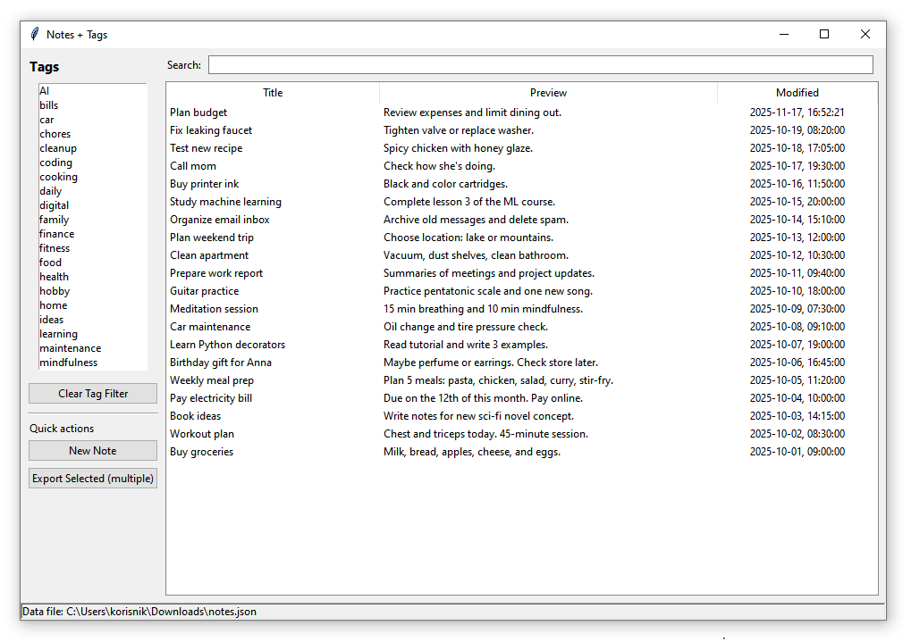
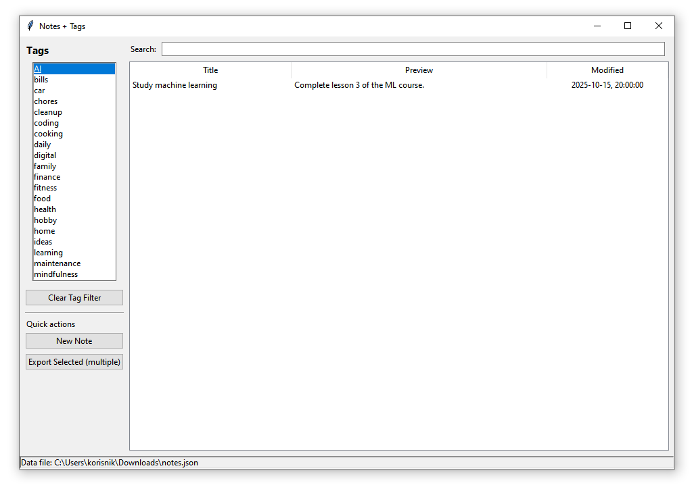
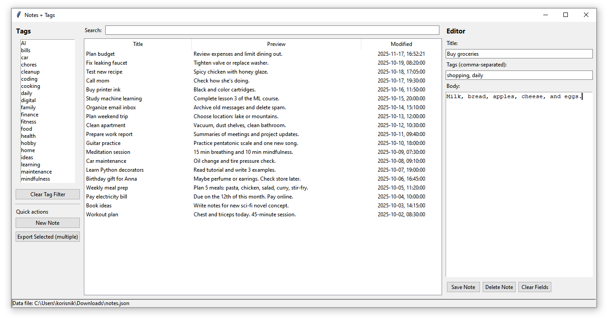

# 📝 Notes + Tags App (Python + Tkinter)


## About the Project

Notes + Tags App is an offline desktop application built with **Python** and **Tkinter** for creating, organizing, and managing personal notes. Notes can be tagged, searched, edited, deleted, and exported to a text file. All information is stored locally in a JSON file, so the application works completely offline.

---

## Screenshots

### Main Window


### Tag Filtering


### Note Editor


---

## Features

- Create, edit, and delete notes.
- Organize notes with multiple tags.
- Search notes by title, content, or tags.
- Filter notes by selected tag.
- Export one or multiple notes to a text file.
- Automatic timestamps for creation and last modification.
- Local JSON storage for offline use.

---

## Technologies Used

- Python 3.7
- Tkinter
- JSON

---

## Requirements

- Python **3.7**

No external packages are required.

---

## Project Structure

```text
notes-tags-app/
├── notes_tags_app.py
├── data/
│   └── notes.json
├── screenshots/
│   ├── main-window.png
│   ├── tags-filter.png
│   └── editor-view.png
├── requirements.txt
├── .gitignore
└── README.md
```

---

## Installation

1. Clone this repository.
2. Run the application:

   ```bash
   python notes_tags_app.py
   ```

---

## Future Improvements

- Rich text formatting.
- Favorite or pinned notes.
- Import notes from Markdown or TXT files.
- Dark mode.
- Backup and restore notes.